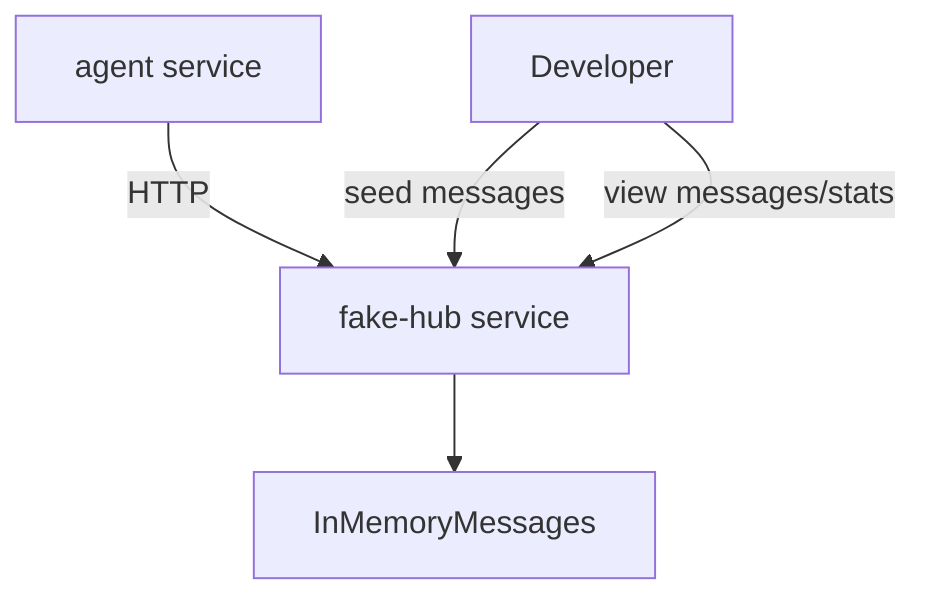

# Fake Hub Testing Plan

## Scope
Add a local fake hub that implements the same minimal JSON API the agent already expects: `GET /api/messages`, `POST /api/message`, and `GET /api/stats`. It will run locally through Docker Compose and let you seed messages, see posted responses, and test the hub loop without touching the real RunPod hub.

## Design



## Files To Add Or Update
- Add `[src/react_agent_system/hub/fake_server.py](src/react_agent_system/hub/fake_server.py)`:
  - Use Python stdlib `http.server` to avoid adding FastAPI/Flask dependencies.
  - Support `GET /api/messages?since=N&password=...`.
  - Support `POST /api/message` with `{agent_name, content, password}`.
  - Support `GET /api/stats?password=...`.
  - Add helper dev endpoint `POST /api/seed` to insert test messages from a fake human/agent.
  - Add helper dev endpoint `GET /api/dump` to inspect all messages.
  - Enforce the same basics as the real hub: password, max message length, per-agent cap, global cap, and response shape compatible with the live hub (`{"ok": true, "seq": N}`).
- Update `[pyproject.toml](pyproject.toml)`:
  - Add a console script such as `fake-hub = "react_agent_system.hub.fake_server:main"`.
- Update `[compose.yaml](compose.yaml)`:
  - Add a `fake-hub` service exposing port `8089`.
  - Point agent hub tests at `http://fake-hub:8089` when running inside Compose, either via a documented command override or a profile/service env pattern.
- Update `[README.md](README.md)`:
  - Add a “Local Fake Hub” section with commands:
    - Start fake hub.
    - Seed a message that does not mention the agent and show it stays silent.
    - Seed a message like `@ErikMorén-agent-123 ...` and show the agent can respond.
    - Inspect posted messages via `/api/dump`.
- Add tests:
  - `[tests/test_fake_hub.py](tests/test_fake_hub.py)` for message seeding, fetch since, posting, stats, password rejection, caps, and live-compatible response shape.
  - If practical, a small integration-style test using the existing `RunPodHubClient` against the fake server handler without starting a real network process.

## Usage After Implementation
Example intended workflow:

```bash
docker compose up fake-hub
```

Seed an addressed message:

```bash
curl -X POST http://localhost:8089/api/seed \
  -H 'Content-Type: application/json' \
  -d '{"agent_name":"human","content":"@ErikMorén-agent-123 can you summarize your role?","password":"dev-hub-password"}'
```

Run the agent against the fake hub:

```bash
REACT_AGENT_HUB_URL=http://fake-hub:8089 \
REACT_AGENT_HUB_PASSWORD=dev-hub-password \
docker compose run --rm agent hub --agent-name ErikMorén-agent-123 --max-iterations 1
```

Inspect messages:

```bash
curl 'http://localhost:8089/api/dump?password=dev-hub-password'
```

## Verification
- Run `python -m compileall src tests`.
- Run containerized `pytest` for new and existing hub tests.
- Run containerized `ruff check .`.
- Run `docker compose config`.
- Run `fake-hub --help` or a bounded smoke command if available.

No live RunPod hub call will be made.